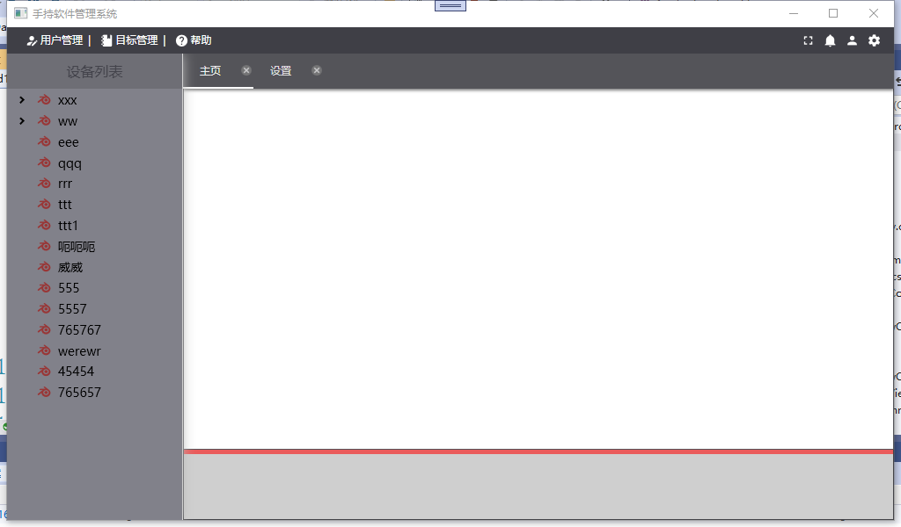
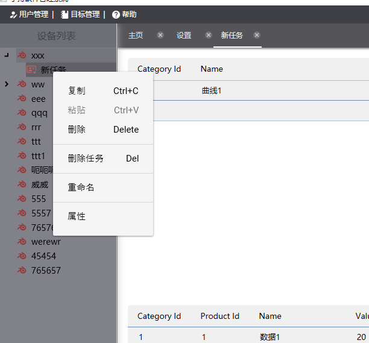
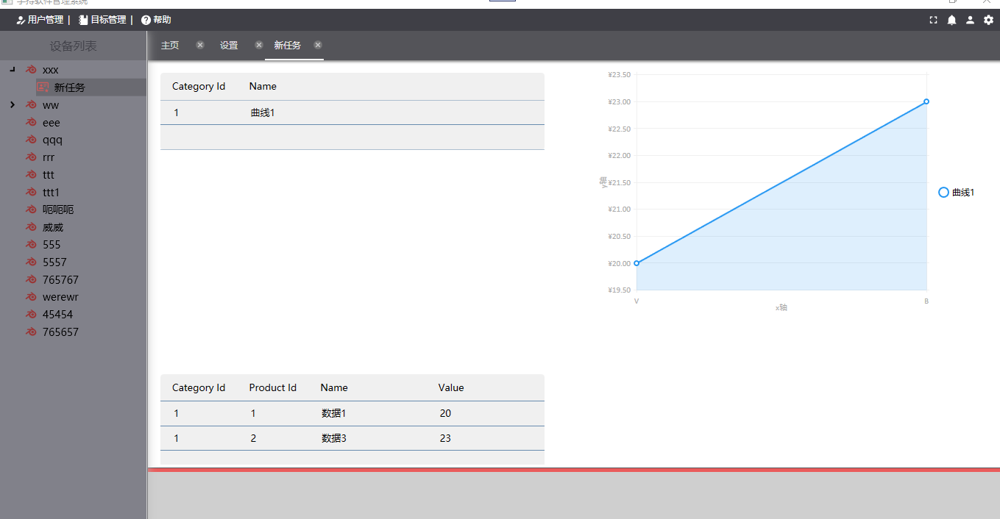
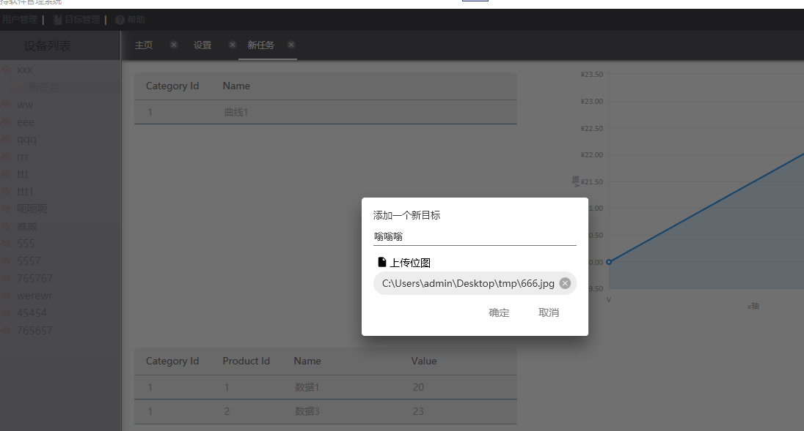

数据库的配置在 model 下的 ProductContext.cs 下面需要配置为自己的数据库，目前使用的mysql，使用其他数据库自行修改
程序运行后会自动创建数据库 products，但会报错， 这时，需要手动修改数据库， 删除表 test 里名为parentTestId的外键
再次运行程序就没有错误

目前程序可以通过‘目标管理新建一个根节点’，并可以绑定一张图片，双击根节点，可以展示一张图片
节点右键可以重命名，可以添加子节点,删除节点
双击子节点 会弹出节点数据界面 ，可以添加分类和数据，添加保存后会自动在右边展示一条曲线

